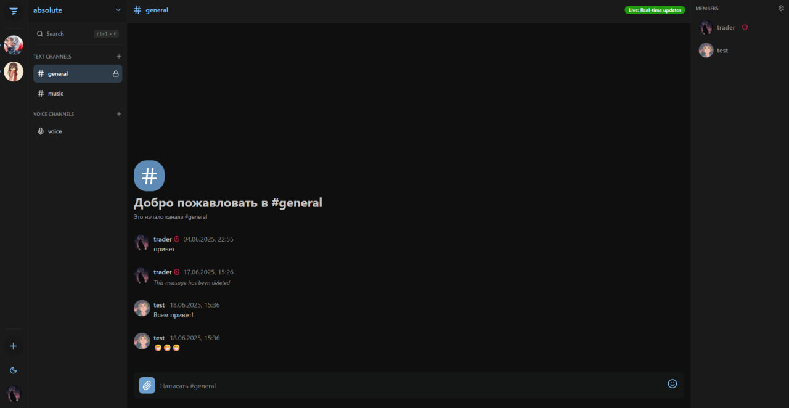
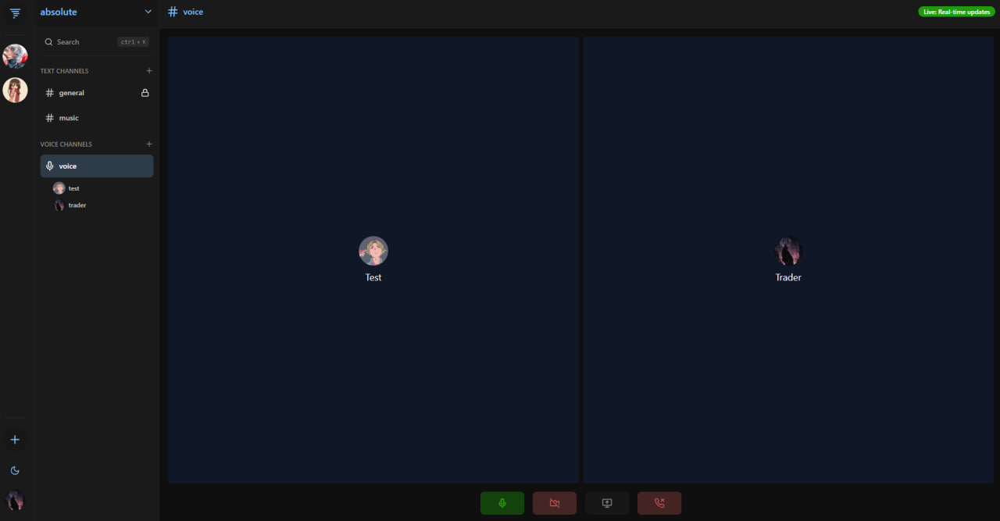
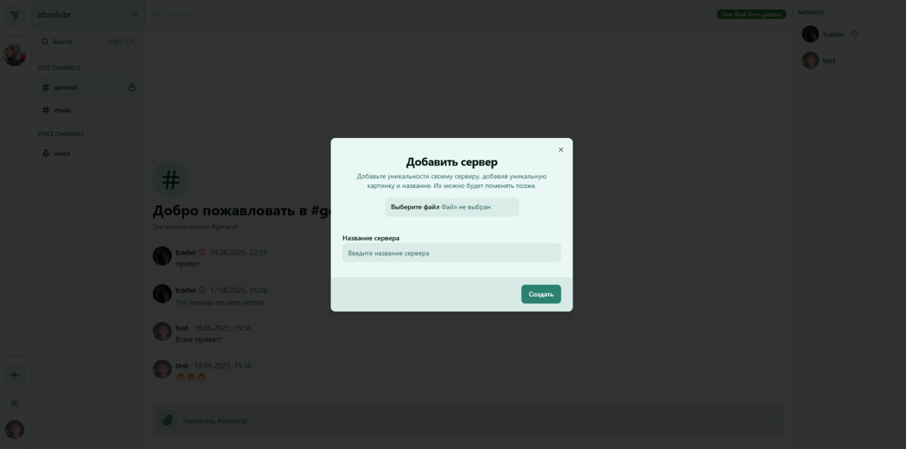

# Kairos

<p align="center">
  <a href="https://skillicons.dev">
    
  </a>
</p>

---

## Содержание

1. [Внешний вид](#внешний-вид)
2. [Основной функционал](#основной-функционал)
3. [Конфигурация](#конфигурация)
4. [Установка и запуск](#установка-и-запуск)
5. [TODO](#todo)

## Внешний вид

<kbd></kbd>
<kbd></kbd>
<kbd></kbd>

## Основной функционал

| Функционал                     | Описание                                                                |
| ------------------------------ | ----------------------------------------------------------------------- |
| `Аутентификация`               | Хранение `access token` в локальном хранилице, `refresh token` в cookie |
| `Личные сообщения`             | Сообщения между пользователями                                          |
| `Сообщения в тектовых каналах` | Сообщения в текстовом канале сервера между его участниками              |
| `Звонок на канале сервера`     | Создание/присоединение к комнате звонка через `mediasoup-client`        |
| `Демонстрация экрана`          | Выбор окна для демонстрации изображения со своего компьютера            |
| `Включение веб-камеры`         | Выключение веб-камеры для демонстрации изображения с нее                |
| `Отправка файлов`              | Сообщение с файлом другому пользователю                                 |

## Конфигурация

В `.env` требуется указать переменные:

| Переменная             | Описание                                  | Значение по умолчанию               |
| ---------------------- | ----------------------------------------- | ----------------------------------- |
| `VITE_WEBSOCKET_URL `  | Url для подкючения к websocket сервера    | `http://localhost:3001`             |
| `VITE_GOOGLE_AUTH_URL` | Ссылка для авторизации через Google OAuth | `http://localhost:3000/auth/google` |
| `VITE_HTTPSP`          | Для работы через HTTPS                    | `true`                              |

## Установка и запуск

Установить зависимости:

```
bun install
```

Запустить веб-приложение:

```
bun dev
```

Запустить приложение:

```
bun tauri dev
```

Собрать приложение:

```
bun tauri build
```

## TODO

| Функционал                  | Описание                                                                                                 |
| --------------------------- | -------------------------------------------------------------------------------------------------------- |
| `P2P Звонок`                | Звонок между 2 пользователями                                                                            |
| `Создание закрытых каналов` | Каналы, к которым не все пользователи имеют доступ                                                       |
| `Уведомления`               | Рассылка уведомлений о совершенных действиях (отправки получения сообщения, вступление на сервер и т.д.) |
